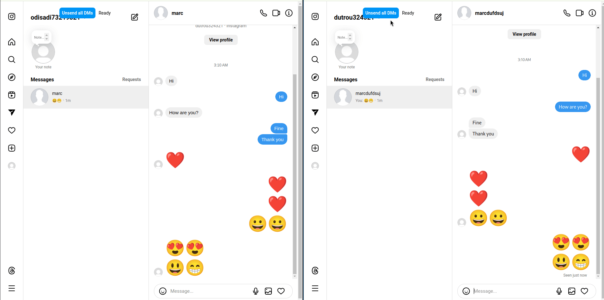

# instagram-dm-unsender (idmu)

Userscript that allows you to mass unsend all your DMs on Instagram

As of 2023 [instagram.com](https://www.instagram.com) doesn't allow batch unsending of messages which is why this project came to be.

The userscript allows a user to batch unsend DMs in a thread on the web version of [instagram.com](https://www.instagram.com) 

⚠️ Only English is supported as of yet so please set your UI language to English before running the script.

⚠️ [This might not work](#this-might-not-work)

## Use cases

- One potential use case would be when individuals seek to transition to Fediverse and would want to "remove" their messages from Meta's database.

## What's the difference between deleting and unsending?

Deleting a thread will only delete messages on your end but the other party will still be able to read your messages.

On the other hand, unsending of a thread will result in the deletion of messages on both ends, rendering the other party unable to read your messages.

## How does it work / How can I use it?

This script is meant to be run on the page that lists the message threads. 

⚠️ **The UI will only appear once you select a message thread**

> This showcases a very simple case where two users are logged to instagram using two distinct browser windows, the user on the right side is the one that's unsending its messages, as you can see, they are removed as well for the user on the left side.

The workflow works as follow:
- Create a list of all messages by querying the DOM with an early messages detection strategy (we test the raw outputs of our ``find-messages-strategy`` against parts of the workflow).
  - For each message do the following:

     - ### Show action menu button:
        Dispatch a mouseover for this message so that the three dots button appears.

     - ### Open action menu:
        Click the three dots button to open the message actions.

     - ### Open unsend confirm modal:
        Click the "Unsend" action button, a modal will open with a dialog that asks the user to confirm the intent.

     - ### Click "confirm":
        Click the "confirm" button inside the modal.

There is no concurrency. Messages are unsent one after the other by using a queue.

⚠️ Instagram has rate limits. After a certain number of messages, you might get blocked from unsending another message for a period of time.

## Installing

Install a Userscript manager for your browser :

- [Firefox](https://addons.mozilla.org/en-US/firefox/addon/violentmonkey/)
- [Chrome](https://chrome.google.com/webstore/detail/violentmonkey/jinjaccalgkegednnccohejagnlnfdag?hl=en)

Finally, install the userscript from OpenUserJS :

[Install latest stable release](https://github.com/thoughtsunificator/instagram-dm-unsender/releases/latest/download/idmu.user.js)

[Install development (master) version](https://github.com/thoughtsunificator/instagram-dm-unsender/raw/userscript/idmu.user.js)

[Older releases](https://github.com/thoughtsunificator/instagram-dm-unsender/releases)

## Development

I recommend using [Violentmonkey](https://violentmonkey.github.io/) or something similar and enabling userscript autoreloading as explained here : https://violentmonkey.github.io/posts/how-to-edit-scripts-with-your-favorite-editor/ 

Install dependencies:
- ``npm install``

To both serve and build with autoreloading:
- ``npm start``

> This will also start an HTTP server and allow autoreloading of the userscript as changes are made.

You can also do a one-time build with:
- ``npm run build``

> The script will build to ``dist/idmu.user.js`` by default.

## This might not work

Instagram web app is serving different UIs, probably based on the user location. [Yours might not be supported](https://github.com/thoughtsunificator/instagram-dm-unsender/issues/1)

Link to the issue : [https://github.com/thoughtsunificator/instagram-dm-unsender/issues/1](https://github.com/thoughtsunificator/instagram-dm-unsender/issues/1)

## Testing

> Please do set the  ``NODE_NO_WARNINGS=1`` to disable  ``punycode `` deprecation warnings.

Use the ``DEBUG=idmu:test`` env to enable debug logs while testing.

Lint files:
- ``npm run lint:ecmascript``

Run test with ava:
- ``npm test``

Coverage:
- ``npm run test:coverage``

## Contributions

Contributions are more than welcome.

## TODO 

- [ ] i18n, make sure it works for all languages
- [ ] l10n, make sure it works not only for the US version but also for the others.
- [ ] alert system (for scenarios such as rate limits)
