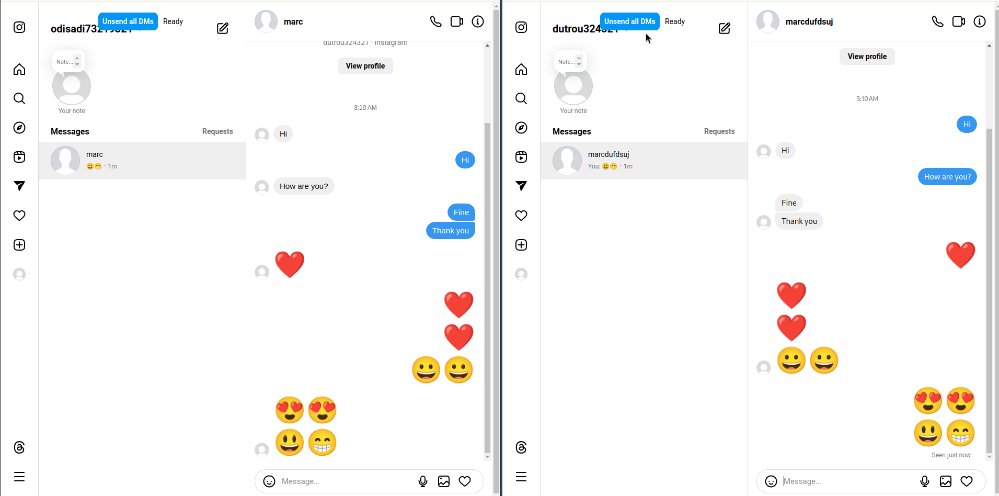

# instagram-dm-unsender (idmu)

Userscript that allows you to mass unsend all your DMs on Instagram. 

In sum, it is a privacy tool that aim to empower Instagram users by giving them more control over their data.

> ⚠️ While unsending prevents the other party from reading your messages it does not always necessarily mean Instagram has deleted your data so make sure to ALSO send a data removal request according to the laws of the country you live in.

## Why

As of 2023 [instagram.com](https://www.instagram.com) would not allow its users to batch unsend their messages which is why this project came to be.

The userscript allows a user to batch unsend DMs in a thread on the web version of [instagram.com](https://www.instagram.com) 

## State of Affairs

⚠️ Only English is supported as of yet so **please set your UI language to English before running the script**.

⚠️ [This might not work](#this-might-not-work)

## Use cases

Individuals seeking to transition to something like Fediverse and want to "remove" their messages from Meta's database.

> If you see a useful use cases that's not here then by all means feel free to edit this file to add it

## What's the difference between deleting and unsending?

Deleting a thread will only delete messages on your end but the other party will still be able to read your messages.

On the other hand, unsending of a thread will result in the deletion of messages on both ends, rendering the other party unable to read your messages.

## How does it work 

What is described below is the default unsend strategy/workflow as implemented by our default ui. 

This script is meant to be run on the page that lists the message threads.  

⚠️ **The UI will only appear once you select a message thread**

> This showcases a very simple case where two users are logged to instagram using two distinct browser windows, the user on the right side is the one that's unsending its messages, as you can see, they are removed as well for the user on the left side.

Click [here](./src/ui/default/README.md) to read about the default unsend strategy/workflow.

⚠️ Instagram has rate limits. After a certain number of messages, you might get temporarily blocked from unsending another message for a period of time. You can confirm this by manually unsending a message, if it fails then you might have been temporarily blocked.

> Still not working? Read the [bug report](#-bug-report) section.

# How can I use it?

> ⚠️ For this to work the chat should not have been deleted prior to running the script

1. [Install the userscript](#installing)
3. Go to your messages and select a chat 
4. There a menu with a button titled "Unsend all DMs" should appear

## Installing

> Don't know what a userscript is? Check out the following introduction: https://github.com/OpenUserJs/OpenUserJS.org/wiki/Userscript-beginners-HOWTO

Install a Userscript manager for your browser :

- [Firefox](https://addons.mozilla.org/en-US/firefox/addon/violentmonkey/)
- [Chrome](https://chrome.google.com/webstore/detail/violentmonkey/jinjaccalgkegednnccohejagnlnfdag?hl=en)

Finally, install the userscript from OpenUserJS :

[Install latest stable release](https://github.com/thoughtsunificator/instagram-dm-unsender/releases/latest/download/idmu.user.js)

[Install development (master) version](https://github.com/thoughtsunificator/instagram-dm-unsender/raw/userscript/idmu.user.js)

[Older releases](https://github.com/thoughtsunificator/instagram-dm-unsender/releases)

## Development

I recommend using [Violentmonkey](https://violentmonkey.github.io/) or something similar and enabling userscript autoreloading as explained here : https://violentmonkey.github.io/posts/how-to-edit-scripts-with-your-favorite-editor/ 

Install dependencies:
- ``npm install``

To both serve and build with autoreloading:
- ``npm start``

> This will also start an HTTP server and allow autoreloading of the userscript as changes are made.

You can also do a one-time build with:
- ``npm run build``

> The script will build to ``dist/idmu.user.js`` by default.

## This might not work

Instagram web app is serving different UIs, probably based on the user location. [Yours might not be supported](https://github.com/thoughtsunificator/instagram-dm-unsender/issues/1)

Link to the issue : [https://github.com/thoughtsunificator/instagram-dm-unsender/issues/1](https://github.com/thoughtsunificator/instagram-dm-unsender/issues/1)

## Testing

> Please do set the  ``NODE_NO_WARNINGS=1`` to disable  ``punycode `` deprecation warnings.

Use the ``DEBUG=idmu:test`` env to enable debug logs while testing.

Lint files:
- ``npm run lint:ecmascript``

Run test with ava:
- ``npm test``
> ``npm run test:debug file.js`` allows you to use v8 debugger while testing (atm only works on one file at a time)

Coverage:
- ``npm run test:coverage``

## 🧒 Contributions

Contributions [are more than welcome](./.github/CONTRIBUTING.md).

## 👾 Bug report 

❗The issue will not be considered unless you provide ALL the required information as per the template. If you're going to do a bug report then do it right.

To report a bug please use [this link](https://github.com/thoughtsunificator/instagram-dm-unsender/issues/new?template=bug_report.md) while following the template.

## 💡 Feature request 

❗Make sure your suggestion is not already on the [TODO.md](TODO.md) and hasn't [already been requested](https://github.com/thoughtsunificator/instagram-dm-unsender/labels/enhancement).

To suggest an idea please use [this link](https://github.com/thoughtsunificator/instagram-dm-unsender/issues/new?template=feature_request.md).
